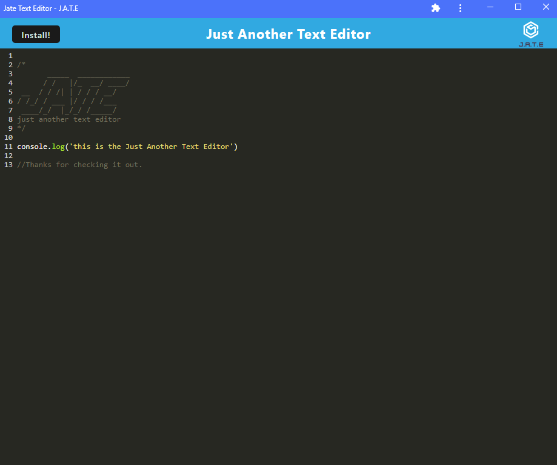

## Table of Contents  
  1.[Description](#Description)  
  2.[Installation](#Installation)  
  3.[Usage](#Usage)  
  4.[Credits](#Credits)  
  5.[License](#License)  
  6.[Badges](#Badges)  
  7.[Contribute](#Contribute)  
  8.[Tests](#Tests)  

## Description
This is a text editor that runs in the browser. Following best Progressive Web Application (PWA) processes.

The application can be viewed locally in your browser upon running the installation (see below for details). Or it can also be installed and ran offline.   
  ## License  
    
  [Link to License](./LICENSE.md)     
  ## Deployed Application  
  https://ancient-meadow-71019.herokuapp.com/  
Click the link above to view a live version of the application.
 
  ## Github Repo  
  https://github.com/Kovaceva11/Browser-Based-Text-Editor  
  ## Installation  
  To install the application, simply visit the deployed heroku link and click the install button. 

  Additionally, you can clone this repo and then in the repo's root terminal run the following commands.
  ```
  npm i
  ```
  ```
  npm run start
  ```

  Once the application has installed, open your browser of choice and enter the following URL.  
  `http://localhost:3000`  
  
  ## Badges  
    
          
  ## Questions?  
  [Contact Me via Email Here](mailto:adam.kovacevich.develop@gmail.com)   
      